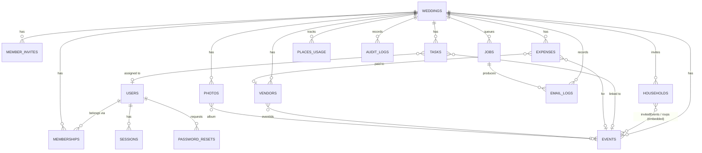

# Make My Marriage: Database Design

| | |
|---|---|
| **Version** | 1.1 (Draft for review) |
| **Date** | 28 September 2026 |
| **Owner** | Irfan |
| **Database** | MongoDB Atlas (M0 in development, paid tier with backups before the first real wedding) |
| **Driver** | Official `mongodb` Node.js driver, validation with Zod |
| **Related docs** | PRD v1.1, System Architecture v1.2, API Spec v1.1 |

---

## 1. Purpose

This document defines every MongoDB collection in Make My Marriage v1: fields, types, required fields, defaults, validation rules, relationships, indexes, the queries they support, what happens to linked data on delete, transactions, data retention, and schema migrations.

It is the source of truth for the Zod schemas, the repository layer, and `scripts/create-indexes.ts`.

---

## 2. Decisions used in this design

| # | Topic | Decision |
|---|---|---|
| 1 | IDs | MongoDB `ObjectId` for every document |
| 2 | Tenancy | One shared database. Every tenant document has `weddingId`, and every tenant index starts with `weddingId` |
| 3 | Money | Integer paise (`amountPaise`). ₹1,250.50 is stored as `125050` |
| 4 | Calendar dates | Text in `YYYY-MM-DD`, with the wedding's timezone stored once on the wedding |
| 5 | Clock times | Text in 24-hour `HH:mm` (e.g. `"18:30"`) |
| 6 | Timestamps | BSON `Date` in UTC (`createdAt`, `sentAt`, etc.) |
| 7 | Counts and summaries | Calculated live with aggregation, no stored counters (except the household's own response status, which lives in the same document as its RSVPs) |
| 8 | Transactions | Only where two or more collections must change together |
| 9 | Deletes | Hard delete, with an audit log entry |
| 10 | Deleting an event | Removed from every household. Its RSVPs move to the household's `archivedRsvps` list |
| 11 | Deleting a vendor | Linked expenses stay. The vendor link is removed, and the vendor's name is kept on the expense as a snapshot |
| 12 | Removing a member | Their tasks become unassigned. Expenses they paid keep their name as a snapshot |
| 13 | Household members | A list of objects with a name (`{ name }`), so a type such as adult or child can be added later without a migration |
| 14 | Expense "paid by" | Either a team member or a free-text name |
| 15 | Custom categories and tags | Stored as arrays on the wedding document |
| 16 | Schema changes | `schemaVersion` on every document, plus numbered migration scripts tracked in a `migrations` collection |
| 17 | Database-level validation | A light `$jsonSchema` validator on each collection for required fields and types, in addition to Zod |

---

## 3. Naming conventions

| Item | Convention | Example |
|---|---|---|
| Collection names | camelCase, plural | `households`, `emailLogs` |
| Field names | camelCase | `weddingDate`, `amountPaise` |
| References | `<entity>Id` holding an `ObjectId` | `weddingId`, `vendorId` |
| Reference arrays | `<entity>Ids` | `eventIds` |
| Enums | lowercase snake_case strings | `not_sent`, `in_progress` |
| Booleans | Plain adjective or `is/has` form | `published`, `hidden`, `emailBounced` |
| R2 file references | `<name>Key` holding the object key | `displayKey`, `coverKey` |
| Snapshots | `<name>Snapshot` for copied values kept after deletion | `vendorNameSnapshot` |

**Standard fields on every document**

| Field | Type | Notes |
|---|---|---|
| `_id` | ObjectId | Generated by the driver |
| `schemaVersion` | int | Starts at `1` |
| `createdAt` | Date | Set on insert |
| `updatedAt` | Date | Set on every update |

These four fields are not repeated in the collection tables below.

---

## 4. Collections overview

| # | Collection | Scope | Purpose | Expected size |
|---|---|---|---|---|
| 1 | `users` | Global | Accounts for couples and family members | 1 per person |
| 2 | `sessions` | Global | Login sessions | A few per user |
| 3 | `passwordResets` | Global | Forgot-password tokens | Short-lived |
| 4 | `rateLimits` | Global | Rate limit and daily email counters | Short-lived |
| 5 | `migrations` | Global | Applied migration scripts | Small |
| 6 | `weddings` | Tenant root | Wedding profile, invitation, website and gallery settings | 1 per wedding |
| 7 | `memberships` | Tenant | Which users belong to which wedding, with role | 2-20 per wedding |
| 8 | `memberInvites` | Tenant | Pending invitations for family members | A few per wedding |
| 9 | `events` | Tenant | Mehendi, Sangeet, Wedding, etc. | 3-10 per wedding |
| 10 | `households` | Tenant | Invited families with invited events and RSVPs | Up to ~400 per wedding |
| 11 | `tasks` | Tenant | Task planner | 20-200 per wedding |
| 12 | `expenses` | Tenant | Expense tracker | 50-500 per wedding |
| 13 | `vendors` | Tenant | Vendor tracker | 10-60 per wedding |
| 14 | `photos` | Tenant | Gallery photos (files in R2) | Up to 5,000 per wedding |
| 15 | `jobs` | Tenant or system | Background job queue | Hundreds per invitation round |
| 16 | `emailLogs` | Tenant or system | Record of every email sent | Hundreds per wedding |
| 17 | `placesUsage` | Tenant | Monthly Google Places search count | 1 per wedding per month |
| 18 | `auditLogs` | Tenant | History of sensitive actions | Hundreds per wedding |

---

## 5. Entity relationships



### 5.1 Embed or reference

| Data | Choice | Reason |
|---|---|---|
| Invitation settings | Embedded in `weddings` | One per wedding, always read with it |
| Website settings | Embedded in `weddings` | One per wedding, small |
| Gallery settings and storage counters | Embedded in `weddings` | One per wedding. Storage reservation needs an atomic update on one document |
| Location | Embedded in `weddings` | One per wedding |
| Invited events and RSVPs | Embedded in `households` | A household has a few events. Invitation and replies are read and written together, and one RSVP save is one atomic update |
| Household members | Embedded in `households` | Small list, never queried alone |
| Vendor attachments | Embedded in `vendors` | Up to 10 per vendor |
| Expense receipt | Embedded in `expenses` | One per expense |
| Events | Separate collection | Referenced by households, tasks, expenses, vendors and photos |
| Photos | Separate collection | Up to 5,000 per wedding, far too many to embed |
| Memberships | Separate collection | Many-to-many between users and weddings |

---

## 6. Global collections

### 6.1 `users`

People who log in: the couple and family members. Guests never have a user record.

| Field | Type | Req | Default | Rules |
|---|---|---|---|---|
| `email` | string | ✅ | | Lowercased and trimmed, valid email, max 254 characters, unique |
| `passwordHash` | string | ✅ | | Argon2id hash. Never returned by the API |
| `name` | string | ✅ | | 1-80 characters |
| `lastLoginAt` | Date | | `null` | Updated on login |
| `passwordChangedAt` | Date | | `null` | Set on password reset |

**Example**
```json
{
  "_id": { "$oid": "66f1a2b3c4d5e6f708091011" },
  "email": "irfan@example.com",
  "passwordHash": "$argon2id$v=19$m=19456,t=2,p=1$...",
  "name": "Irfan",
  "lastLoginAt": { "$date": "2026-09-24T06:30:00Z" },
  "passwordChangedAt": null,
  "schemaVersion": 1,
  "createdAt": { "$date": "2026-09-20T10:00:00Z" },
  "updatedAt": { "$date": "2026-09-24T06:30:00Z" }
}
```

**Indexes**
| Index | Type | Serves |
|---|---|---|
| `{ email: 1 }` | Unique | Login, sign-up duplicate check, member invite matching |

### 6.2 `sessions`

| Field | Type | Req | Default | Rules |
|---|---|---|---|---|
| `tokenHash` | string | ✅ | | SHA-256 hex of the session ID (64 characters). The raw ID lives only in the cookie |
| `userId` | ObjectId | ✅ | | → `users._id` |
| `expiresAt` | Date | ✅ | now + 30 days | Extended when active |
| `lastSeenAt` | Date | ✅ | now | Updated at most once per day |
| `userAgent` | string | | `null` | Max 300 characters, for "your devices" display |

**Indexes**
| Index | Type | Serves |
|---|---|---|
| `{ tokenHash: 1 }` | Unique | Session lookup on every request |
| `{ userId: 1 }` | | Ending every session on password reset |
| `{ expiresAt: 1 }` | TTL, `expireAfterSeconds: 0` | Automatic cleanup |

### 6.3 `passwordResets`

| Field | Type | Req | Default | Rules |
|---|---|---|---|---|
| `tokenHash` | string | ✅ | | SHA-256 hex of the reset token |
| `userId` | ObjectId | ✅ | | → `users._id` |
| `expiresAt` | Date | ✅ | now + 30 minutes | |
| `usedAt` | Date | | `null` | Set when used. A used token is rejected |

**Indexes**
| Index | Type | Serves |
|---|---|---|
| `{ tokenHash: 1 }` | Unique | Reset lookup |
| `{ expiresAt: 1 }` | TTL, `expireAfterSeconds: 3600` | Cleanup one hour after expiry |

### 6.4 `rateLimits`

Fixed-window counters for rate limits and the daily email limit.

| Field | Type | Req | Default | Rules |
|---|---|---|---|---|
| `key` | string | ✅ | | e.g. `login:email:irfan@example.com`, `rsvp:token:abc`, `email:daily:2026-09-24` |
| `windowStart` | Date | ✅ | | Start of the time window |
| `count` | int | ✅ | 0 | |
| `expiresAt` | Date | ✅ | | End of the window plus a small margin |

**Indexes**
| Index | Type | Serves |
|---|---|---|
| `{ key: 1, windowStart: 1 }` | Unique | Atomic increment per window |
| `{ expiresAt: 1 }` | TTL, `expireAfterSeconds: 0` | Cleanup |

**Increment pattern**
```js
db.rateLimits.findOneAndUpdate(
  { key, windowStart },
  { $inc: { count: 1 }, $setOnInsert: { expiresAt } },
  { upsert: true, returnDocument: "after" }
)
// if result.count > limit → 429 RATE_LIMITED
```

### 6.5 `migrations`

| Field | Type | Req | Rules |
|---|---|---|---|
| `name` | string | ✅ | e.g. `0003-add-household-searchText`, unique |
| `appliedAt` | Date | ✅ | |

---

## 7. Tenant collections

### 7.1 `weddings`

The tenant root. Every other tenant document points to a wedding through `weddingId`.

**Top-level fields**

| Field | Type | Req | Default | Rules |
|---|---|---|---|---|
| `brideName` | string | ✅ | | 1-60 characters, at least one letter |
| `groomName` | string | ✅ | | 1-60 characters, at least one letter |
| `weddingDate` | string | ✅ | | `YYYY-MM-DD`. Main wedding date, used for the countdown and retention. From today to 5 years ahead (in the wedding timezone) when the wedding is created |
| `city` | string | ✅ | | 1-80 characters |
| `venue` | string | | `""` | Max 200 characters. Free-text venue entered by the couple. Missing on weddings created before the field existed; read as `""`. The Google Places `location` (Phase 4) is separate and more precise |
| `timezone` | string | ✅ | `"Asia/Kolkata"` | Valid IANA timezone, in its standard spelling (`Asia/Kolkata`, not `asia/kolkata`) |
| `sidesEnabled` | bool | ✅ | `false` | Bride side / groom side feature |
| `status` | enum | ✅ | `"active"` | `active`, `archived` |
| `archivedAt` | Date | | `null` | |
| `createdByUserId` | ObjectId | ✅ | | → `users._id` |
| `customExpenseCategories` | string[] | ✅ | `[]` | Max 30 items, each 1-40 characters, unique |
| `guestTags` | string[] | ✅ | `[]` | Max 50 items, each 1-30 characters, unique |
| `location` | object | | `null` | See below |
| `invitation` | object | ✅ | defaults | See below |
| `website` | object | ✅ | defaults | See below |
| `gallery` | object | ✅ | defaults | See below |
| `retention` | object | ✅ | defaults | See below |

**`location`** (set from Google Places)

| Field | Type | Req | Rules |
|---|---|---|---|
| `placeId` | string | ✅ | Google place ID |
| `name` | string | ✅ | Max 200 characters |
| `address` | string | ✅ | Max 300 characters |
| `lat` | double | ✅ | -90 to 90 |
| `lng` | double | ✅ | -180 to 180 |
| `searchRadiusKm` | int | ✅ | 1-50, default `10` |

**`invitation`**

| Field | Type | Default | Rules |
|---|---|---|---|
| `mediaKey` | string | `null` | R2 key of the uploaded invite |
| `mediaType` | enum | `null` | `image`, `video` |
| `mediaSizeBytes` | int | `null` | Image ≤ 10 MB, video ≤ 50 MB |
| `message` | string | default text | Max 2,000 characters |
| `rsvpDeadline` | string | `null` | `YYYY-MM-DD`, last day replies are accepted (inclusive, in the wedding timezone) |
| `autoRemindersEnabled` | bool | `true` | 7 and 2 days before the deadline |

**`website`**

| Field | Type | Default | Rules |
|---|---|---|---|
| `slug` | string | `null` | Pattern `^[a-z0-9]+(-[a-z0-9]+)*$`, 3-60 characters, unique, not a reserved word |
| `published` | bool | `false` | |
| `publishedAt` | Date | `null` | |
| `theme` | enum | `"classic"` | `classic`, `floral`, `modern` |
| `accentColor` | string | `"#B4535F"` | Hex `#RRGGBB` |
| `sections` | object | all `true` | `{ hero, story, events, photos, liveStream, gallery }`, each bool |
| `story` | string | `""` | Max 5,000 characters |
| `coverKey` | string | `null` | R2 key |
| `photoKeys` | string[] | `[]` | Max 12 |
| `liveStream` | object | `null` | `{ url, videoId, startsAt (Date), enabled (bool) }`. URL must be YouTube |
| `indexable` | bool | `false` | Search engine indexing |

**`gallery`**

| Field | Type | Default | Rules |
|---|---|---|---|
| `token` | string | generated | 22-character random token, unique |
| `uploadsOpen` | bool | `true` | |
| `guestViewing` | bool | `true` | If `false`, guests can upload but not browse |
| `storageUsedBytes` | long | `0` | Confirmed uploads |
| `storageReservedBytes` | long | `0` | Upload URLs issued, not yet confirmed |
| `storageCapBytes` | long | `3221225472` | 3 GB |

**`retention`**

| Field | Type | Default | Rules |
|---|---|---|---|
| `warningSentAt` | Date | `null` | Set when the 11-month warning email is sent |
| `filesDeletedAt` | Date | `null` | Set when gallery and file objects are deleted |

**Example**
```json
{
  "_id": { "$oid": "66f1b0000000000000000001" },
  "brideName": "Nafiya",
  "groomName": "Irfan",
  "weddingDate": "2028-04-14",
  "city": "Kochi",
  "venue": "Grand Hyatt, Bolgatty Island",
  "timezone": "Asia/Kolkata",
  "sidesEnabled": true,
  "status": "active",
  "archivedAt": null,
  "createdByUserId": { "$oid": "66f1a2b3c4d5e6f708091011" },
  "customExpenseCategories": ["Mehendi artist"],
  "guestTags": ["College friends", "Office"],
  "location": {
    "placeId": "ChIJ...",
    "name": "Grand Hyatt Kochi Bolgatty",
    "address": "Bolgatty Island, Mulavukad, Kochi, Kerala",
    "lat": 9.9867,
    "lng": 76.2663,
    "searchRadiusKm": 10
  },
  "invitation": {
    "mediaKey": "weddings/66f1b.../invitation/abc.jpg",
    "mediaType": "image",
    "mediaSizeBytes": 845123,
    "message": "With the blessings of our families...",
    "rsvpDeadline": "2028-03-31",
    "autoRemindersEnabled": true
  },
  "website": {
    "slug": "nafiya-irfan-14-apr-2028",
    "published": true,
    "publishedAt": { "$date": "2028-01-10T08:00:00Z" },
    "theme": "floral",
    "accentColor": "#B4535F",
    "sections": { "hero": true, "story": true, "events": true, "photos": true, "liveStream": true, "gallery": true },
    "story": "We met at...",
    "coverKey": "weddings/66f1b.../website/cover.webp",
    "photoKeys": [],
    "liveStream": { "url": "https://youtu.be/xyz123", "videoId": "xyz123", "startsAt": { "$date": "2028-04-14T05:30:00Z" }, "enabled": true },
    "indexable": false
  },
  "gallery": {
    "token": "q8Zt2mKp4vX9sL1aB7cD3e",
    "uploadsOpen": true,
    "guestViewing": true,
    "storageUsedBytes": 0,
    "storageReservedBytes": 0,
    "storageCapBytes": 3221225472
  },
  "retention": { "warningSentAt": null, "filesDeletedAt": null },
  "schemaVersion": 1,
  "createdAt": { "$date": "2026-09-20T10:05:00Z" },
  "updatedAt": { "$date": "2026-09-24T06:40:00Z" }
}
```

**Indexes**
| Index | Type | Serves |
|---|---|---|
| `{ "website.slug": 1 }` | Unique, partial (`website.slug` is a string) | Public website lookup, slug availability |
| `{ "gallery.token": 1 }` | Unique | Gallery token lookup |
| `{ status: 1, weddingDate: 1 }` | | Daily retention and reminder jobs |

**Storage reservation (atomic, respects the cap)**
```js
db.weddings.updateOne(
  {
    _id: weddingId,
    status: "active",
    "gallery.uploadsOpen": true,
    $expr: {
      $lte: [
        { $add: ["$gallery.storageUsedBytes", "$gallery.storageReservedBytes", requestedBytes] },
        "$gallery.storageCapBytes"
      ]
    }
  },
  { $inc: { "gallery.storageReservedBytes": requestedBytes } }
)
// matchedCount === 0 → 413 STORAGE_LIMIT_REACHED (or uploads closed)
```

**Confirming uploads**
```js
db.weddings.updateOne(
  { _id: weddingId },
  { $inc: { "gallery.storageReservedBytes": -reservedBytes, "gallery.storageUsedBytes": actualBytes } }
)
```

### 7.2 `memberships`

| Field | Type | Req | Default | Rules |
|---|---|---|---|---|
| `weddingId` | ObjectId | ✅ | | → `weddings._id` |
| `userId` | ObjectId | ✅ | | → `users._id` |
| `role` | enum | ✅ | | `admin`, `manager` |
| `sideScope` | enum | ✅ | `"both"` | `bride`, `groom`, `both`. Ignored when sides are off. Always `both` for admins |
| `invitedByUserId` | ObjectId | | `null` | `null` for the wedding creator |
| `joinedAt` | Date | ✅ | now | |

**Rules**
- One membership per user per wedding.
- At most 2 `admin` memberships per wedding (checked in the service inside the same transaction that adds one).
- A user has at most 1 `admin` membership across all weddings: each person is an admin of only their own wedding. Enforced by a unique partial index, so concurrent requests can't both succeed. `manager` memberships are unlimited, but a user with any membership can't create a wedding (checked in the service).
- A wedding must always keep at least 1 admin. The last admin can't be removed or demoted.

**Indexes**
| Index | Type | Serves |
|---|---|---|
| `{ weddingId: 1, userId: 1 }` | Unique | Membership check on every private request |
| `{ userId: 1 }` | | "My weddings" list and wedding switcher |
| `{ weddingId: 1, role: 1 }` | | Admin count, team list |
| `{ userId: 1 }` named `one_admin_wedding_per_user` | Unique, partial (`role: "admin"`) | One admin wedding per person |

### 7.3 `memberInvites`

| Field | Type | Req | Default | Rules |
|---|---|---|---|---|
| `weddingId` | ObjectId | ✅ | | |
| `email` | string | ✅ | | Lowercased |
| `role` | enum | ✅ | | `admin`, `manager` |
| `sideScope` | enum | ✅ | `"both"` | |
| `tokenHash` | string | ✅ | | SHA-256 hex of the 43-character link token. The raw link is shown to the admin once (on invite or renew) and never stored |
| `status` | enum | ✅ | `"pending"` | `pending`, `accepted`, `cancelled`, `expired`. A pending invite past `expiresAt` is treated as expired when read (no job needed); `expired` is stored when a new invite replaces it |
| `expiresAt` | Date | ✅ | now + 7 days | |
| `invitedByUserId` | ObjectId | ✅ | | |
| `acceptedByUserId` | ObjectId | | `null` | |
| `acceptedAt` | Date | | `null` | |

**Indexes**
| Index | Type | Serves |
|---|---|---|
| `{ tokenHash: 1 }` | Unique | Accepting an invite |
| `{ weddingId: 1, email: 1 }` | Unique, partial (`status: "pending"`) | Only one pending invite per email per wedding |
| `{ weddingId: 1, status: 1 }` | | Pending invites list |

### 7.4 `events`

| Field | Type | Req | Default | Rules |
|---|---|---|---|---|
| `weddingId` | ObjectId | ✅ | | |
| `name` | string | ✅ | | 1-60 characters |
| `presetKey` | enum | ✅ | `"custom"` | `engagement`, `mehendi`, `haldi`, `sangeet`, `wedding`, `reception`, `custom` |
| `date` | string | ✅ | | `YYYY-MM-DD` |
| `startTime` | string | ✅ | | `HH:mm` |
| `endTime` | string | | `null` | `HH:mm`, after `startTime` unless the event runs past midnight |
| `venueName` | string | | `""` | Max 120 characters |
| `address` | string | | `""` | Max 300 characters |
| `mapUrl` | string | | `null` | Valid https URL |
| `dressCode` | string | | `""` | Max 120 characters |
| `notes` | string | | `""` | Max 1,000 characters |
| `showOnWebsite` | bool | ✅ | `true` | |
| `order` | int | ✅ | | Display order, starting at 0 |

**Indexes**
| Index | Type | Serves |
|---|---|---|
| `{ weddingId: 1, order: 1 }` | | Event list and timeline |
| `{ weddingId: 1, date: 1, startTime: 1 }` | | Upcoming events on the dashboard |

### 7.5 `households`

An invited family or group. Holds its invited events and RSVP replies.

**Top-level fields**

| Field | Type | Req | Default | Rules |
|---|---|---|---|---|
| `weddingId` | ObjectId | ✅ | | |
| `displayName` | string | ✅ | | 1-100 characters, e.g. "Sharma family" |
| `members` | object[] | ✅ | `[]` | Max 30. Each `{ name: string (1-80) }` |
| `headcount` | int | ✅ | members count, or 1 | 1-50 |
| `email` | string | | `null` | Lowercased, valid email |
| `phone` | string | | `null` | Digits with optional leading `+`, 7-15 digits |
| `side` | enum | | `null` | `bride`, `groom`. Required when sides are enabled |
| `tags` | string[] | ✅ | `[]` | Each must exist in `weddings.guestTags` |
| `notes` | string | | `""` | Max 1,000 characters |
| `searchText` | string | ✅ | computed | Lowercased display name, member names, email and phone, for search |
| `token` | string | ✅ | generated | 22-character random token, unique |
| `invitedEvents` | object[] | ✅ | `[]` | See below |
| `rsvps` | object[] | ✅ | `[]` | See below |
| `archivedRsvps` | object[] | ✅ | `[]` | RSVPs for deleted or removed events |
| `inviteStatus` | enum | ✅ | `"not_sent"` | `not_sent`, `queued`, `sent`, `sent_manually`, `failed` |
| `sentAt` | Date | | `null` | First successful send |
| `openedAt` | Date | | `null` | First time the guest page loaded |
| `responseStatus` | enum | ✅ | `"none"` | `none`, `partial`, `complete`. Recalculated on every RSVP or invited-events change |
| `emailBounced` | bool | ✅ | `false` | Set from Resend webhooks |
| `lastRemindedAt` | Date | | `null` | |
| `reminderCount` | int | ✅ | `0` | |
| `remindersOptOut` | bool | ✅ | `false` | Guest clicked "stop reminders" |
| `importBatchId` | string | | `null` | Set for households created by a CSV import |

**`invitedEvents[]`**

| Field | Type | Req | Rules |
|---|---|---|---|
| `eventId` | ObjectId | ✅ | → `events._id` in the same wedding. No duplicates |
| `headcount` | int | ✅ | 1 up to the household's `headcount` |

**`rsvps[]`**

| Field | Type | Req | Rules |
|---|---|---|---|
| `eventId` | ObjectId | ✅ | Must be in `invitedEvents`. One RSVP per event |
| `status` | enum | ✅ | `attending`, `declined` |
| `attendingCount` | int | ✅ | `0` if declined, otherwise 1 up to the invited headcount for that event |
| `note` | string | | Max 500 characters |
| `recordedBy` | enum | ✅ | `guest`, `host` |
| `recordedByUserId` | ObjectId | | Set when `recordedBy` is `host` |
| `respondedAt` | Date | ✅ | First reply |
| `updatedAt` | Date | ✅ | Last change |

**`archivedRsvps[]`**: same fields as `rsvps[]`, plus `eventNameSnapshot` (string) and `archivedAt` (Date).

**Response status rule**
- `none`: no RSVPs.
- `partial`: some invited events have an RSVP, not all.
- `complete`: every invited event has an RSVP.

**Example**
```json
{
  "_id": { "$oid": "66f1c0000000000000000101" },
  "weddingId": { "$oid": "66f1b0000000000000000001" },
  "displayName": "Sharma family",
  "members": [{ "name": "Rajesh Sharma" }, { "name": "Priya Sharma" }, { "name": "Aarav Sharma" }],
  "headcount": 3,
  "email": "rajesh.sharma@example.com",
  "phone": "+919876543210",
  "side": "groom",
  "tags": ["Office"],
  "notes": "",
  "searchText": "sharma family rajesh sharma priya sharma aarav sharma rajesh.sharma@example.com +919876543210",
  "token": "Hk3nP0xQ7rT2wY5zA9bC1d",
  "invitedEvents": [
    { "eventId": { "$oid": "66f1d0000000000000000002" }, "headcount": 3 },
    { "eventId": { "$oid": "66f1d0000000000000000003" }, "headcount": 2 }
  ],
  "rsvps": [
    {
      "eventId": { "$oid": "66f1d0000000000000000002" },
      "status": "attending",
      "attendingCount": 3,
      "note": "Looking forward to it!",
      "recordedBy": "guest",
      "recordedByUserId": null,
      "respondedAt": { "$date": "2028-02-02T12:00:00Z" },
      "updatedAt": { "$date": "2028-02-02T12:00:00Z" }
    }
  ],
  "archivedRsvps": [],
  "inviteStatus": "sent",
  "sentAt": { "$date": "2028-01-15T03:30:00Z" },
  "openedAt": { "$date": "2028-01-15T09:12:00Z" },
  "responseStatus": "partial",
  "emailBounced": false,
  "lastRemindedAt": null,
  "reminderCount": 0,
  "remindersOptOut": false,
  "importBatchId": "imp_2026_09_24_01",
  "schemaVersion": 1,
  "createdAt": { "$date": "2026-09-24T07:00:00Z" },
  "updatedAt": { "$date": "2028-02-02T12:00:00Z" }
}
```

**Indexes**
| Index | Type | Serves |
|---|---|---|
| `{ token: 1 }` | Unique | Guest invitation page and RSVP |
| `{ weddingId: 1, side: 1, displayName: 1 }` | Collation `{ locale: "en", strength: 2 }` | Guest list sorted by name, with side filter |
| `{ weddingId: 1, inviteStatus: 1 }` | | "Not sent" list, bulk send |
| `{ weddingId: 1, responseStatus: 1 }` | | Non-responders for reminders |
| `{ weddingId: 1, "invitedEvents.eventId": 1 }` | Multikey | Households invited to an event, RSVP summary |
| `{ weddingId: 1, tags: 1 }` | Multikey | Tag filter |
| `{ weddingId: 1, email: 1 }` | | Duplicate warning, bounce matching |

**Search:** filter by `weddingId` (and `side` when scoped), then a case-insensitive regex on `searchText`. For a few hundred households per wedding this is fast without a text index.

**RSVP write (guest or host)**
```js
// Service first checks: token valid, wedding active, deadline not passed (for guests),
// event is in invitedEvents, attendingCount <= invited headcount.
// If an RSVP exists for this event, update it; otherwise push a new one.
db.households.updateOne(
  { _id: householdId, weddingId, "rsvps.eventId": eventId },
  { $set: {
      "rsvps.$.status": status,
      "rsvps.$.attendingCount": attendingCount,
      "rsvps.$.note": note,
      "rsvps.$.recordedBy": recordedBy,
      "rsvps.$.updatedAt": now,
      updatedAt: now
  } }
)
// if matchedCount === 0:
db.households.updateOne(
  { _id: householdId, weddingId, "rsvps.eventId": { $ne: eventId } },
  { $push: { rsvps: { eventId, status, attendingCount, note, recordedBy, respondedAt: now, updatedAt: now } },
    $set: { updatedAt: now } }
)
// then recalculate responseStatus with a pipeline update on the same document
```

**RSVP summary per event (aggregation)**
```js
db.households.aggregate([
  { $match: { weddingId, ...(sideScope !== "both" ? { side: sideScope } : {}) } },
  { $unwind: "$invitedEvents" },
  { $addFields: {
      rsvp: { $first: { $filter: {
        input: "$rsvps", as: "r", cond: { $eq: ["$$r.eventId", "$invitedEvents.eventId"] }
      } } }
  } },
  { $group: {
      _id: "$invitedEvents.eventId",
      invitedHouseholds: { $sum: 1 },
      invitedHeadcount: { $sum: "$invitedEvents.headcount" },
      respondedHouseholds: { $sum: { $cond: [{ $ifNull: ["$rsvp", false] }, 1, 0] } },
      attendingHouseholds: { $sum: { $cond: [{ $eq: ["$rsvp.status", "attending"] }, 1, 0] } },
      attendingHeadcount: { $sum: { $ifNull: ["$rsvp.attendingCount", 0] } },
      declinedHouseholds: { $sum: { $cond: [{ $eq: ["$rsvp.status", "declined"] }, 1, 0] } }
  } },
  { $addFields: { pendingHouseholds: { $subtract: ["$invitedHouseholds", "$respondedHouseholds"] } } }
])
```

### 7.6 `tasks`

| Field | Type | Req | Default | Rules |
|---|---|---|---|---|
| `weddingId` | ObjectId | ✅ | | |
| `title` | string | ✅ | | 1-120 characters |
| `description` | string | | `""` | Max 2,000 characters |
| `dueDate` | string | | `null` | `YYYY-MM-DD` |
| `assigneeUserId` | ObjectId | | `null` | Must be a current member of the wedding |
| `status` | enum | ✅ | `"todo"` | `todo`, `in_progress`, `done` |
| `eventId` | ObjectId | | `null` | → `events._id` |
| `completedAt` | Date | | `null` | Set when status becomes `done` |
| `createdByUserId` | ObjectId | ✅ | | |
| `source` | enum | ✅ | `"manual"` | `manual`, `starter` (from the starter checklist) |
| `lastReminderFor` | string | | `null` | The `dueDate` a reminder was last sent for, so reminders aren't sent twice |

**Indexes**
| Index | Type | Serves |
|---|---|---|
| `{ weddingId: 1, status: 1, dueDate: 1 }` | | Task list, due soon and overdue on the dashboard |
| `{ weddingId: 1, assigneeUserId: 1, status: 1 }` | | "My tasks" |
| `{ weddingId: 1, eventId: 1 }` | | Tasks for an event, event delete cleanup |
| `{ status: 1, dueDate: 1 }` | Partial (`assigneeUserId` exists and not null) | Daily due-date reminder job across weddings |

### 7.7 `expenses`

| Field | Type | Req | Default | Rules |
|---|---|---|---|---|
| `weddingId` | ObjectId | ✅ | | |
| `amountPaise` | long | ✅ | | 1 to 100,000,000,000 (₹1 billion) |
| `date` | string | ✅ | | `YYYY-MM-DD` |
| `category` | string | ✅ | | A preset key or a value in `weddings.customExpenseCategories` |
| `description` | string | ✅ | | 1-200 characters |
| `eventId` | ObjectId | | `null` | `null` means "General" |
| `vendorId` | ObjectId | | `null` | → `vendors._id` |
| `vendorNameSnapshot` | string | | `null` | Copied when linked. Kept if the vendor is deleted |
| `paidBy` | object | ✅ | | `{ type: "member", userId, name }` or `{ type: "name", name }`. `name` 1-80 characters |
| `notes` | string | | `""` | Max 1,000 characters |
| `receipt` | object | | `null` | `{ key, fileName, contentType, sizeBytes }`. Image or PDF, ≤ 10 MB |
| `createdByUserId` | ObjectId | ✅ | | |

**Preset category keys:** `venue`, `catering`, `decor`, `photography_video`, `attire`, `jewellery`, `makeup_beauty`, `invitations`, `entertainment`, `transport`, `gifts`, `miscellaneous`.

**Example**
```json
{
  "_id": { "$oid": "66f1e0000000000000000201" },
  "weddingId": { "$oid": "66f1b0000000000000000001" },
  "amountPaise": 7500000,
  "date": "2027-11-02",
  "category": "photography_video",
  "description": "Photographer advance",
  "eventId": null,
  "vendorId": { "$oid": "66f1f0000000000000000301" },
  "vendorNameSnapshot": "Lens & Light Studios",
  "paidBy": { "type": "name", "name": "Papa" },
  "notes": "Balance due after the wedding",
  "receipt": { "key": "weddings/66f1b.../receipts/r1.pdf", "fileName": "advance.pdf", "contentType": "application/pdf", "sizeBytes": 182340 },
  "createdByUserId": { "$oid": "66f1a2b3c4d5e6f708091011" },
  "schemaVersion": 1,
  "createdAt": { "$date": "2027-11-02T10:00:00Z" },
  "updatedAt": { "$date": "2027-11-02T10:00:00Z" }
}
```

**Indexes**
| Index | Type | Serves |
|---|---|---|
| `{ weddingId: 1, date: -1, _id: -1 }` | | Expense list (newest first, cursor pagination) |
| `{ weddingId: 1, category: 1 }` | | Category filter and totals |
| `{ weddingId: 1, eventId: 1 }` | | Event filter, event delete cleanup |
| `{ weddingId: 1, vendorId: 1 }` | | Vendor total paid, vendor delete cleanup |

**Expense summary (aggregation)**
```js
db.expenses.aggregate([
  { $match: { weddingId, date: { $gte: from, $lte: to } } },
  { $facet: {
      total:      [{ $group: { _id: null, amountPaise: { $sum: "$amountPaise" }, count: { $sum: 1 } } }],
      byCategory: [{ $group: { _id: "$category", amountPaise: { $sum: "$amountPaise" } } }, { $sort: { amountPaise: -1 } }],
      byEvent:    [{ $group: { _id: "$eventId", amountPaise: { $sum: "$amountPaise" } } }],
      byVendor:   [{ $match: { vendorId: { $ne: null } } }, { $group: { _id: "$vendorId", amountPaise: { $sum: "$amountPaise" } } }],
      byPaidBy:   [{ $group: { _id: "$paidBy.name", amountPaise: { $sum: "$amountPaise" } } }]
  } }
])
```

### 7.8 `vendors`

| Field | Type | Req | Default | Rules |
|---|---|---|---|---|
| `weddingId` | ObjectId | ✅ | | |
| `name` | string | ✅ | | 1-120 characters |
| `category` | enum | ✅ | | `venue`, `caterer`, `photographer`, `videographer`, `decorator`, `makeup_artist`, `mehendi_artist`, `dj_music`, `florist`, `transport`, `priest_officiant`, `other` |
| `phone` | string | | `null` | 7-15 digits, optional `+` |
| `whatsapp` | string | | `null` | Same rule as phone |
| `email` | string | | `null` | Valid email |
| `notes` | string | | `""` | Max 2,000 characters |
| `status` | enum | ✅ | `"shortlisted"` | `shortlisted`, `booked`, `completed` |
| `eventIds` | ObjectId[] | ✅ | `[]` | Events in the same wedding, no duplicates |
| `source` | enum | ✅ | `"manual"` | `manual`, `google` |
| `placeId` | string | | `null` | Only Google content kept long-term |
| `attachments` | object[] | ✅ | `[]` | Max 10. Each `{ key, fileName, contentType, sizeBytes, uploadedAt }`. Image or PDF, ≤ 10 MB |

**Indexes**
| Index | Type | Serves |
|---|---|---|
| `{ weddingId: 1, category: 1, status: 1 }` | | Vendor list with filters |
| `{ weddingId: 1, eventIds: 1 }` | Multikey | Vendors for an event, event delete cleanup |
| `{ weddingId: 1, placeId: 1 }` | Unique, partial (`placeId` is a string) | Prevent saving the same Google place twice |

**Total paid per vendor:** the `byVendor` group of the expense summary, or a single `$match: { weddingId, vendorId }` + `$group` on the vendor page.

### 7.9 `photos`

Metadata for gallery photos. Files live in R2.

| Field | Type | Req | Default | Rules |
|---|---|---|---|---|
| `weddingId` | ObjectId | ✅ | | |
| `albumEventId` | ObjectId | | `null` | `null` means the "General" album |
| `uploaderName` | string | | `null` | Max 60 characters, entered by the guest |
| `displayKey` | string | ✅ | | `weddings/{weddingId}/gallery/{photoId}/display.webp` |
| `thumbKey` | string | ✅ | | `.../thumb.webp` |
| `width` | int | ✅ | | Display copy width in pixels |
| `height` | int | ✅ | | Display copy height |
| `reservedBytes` | int | ✅ | | Size reserved when the upload URL was issued |
| `sizeBytes` | int | | `null` | Actual display + thumbnail size, set on confirm |
| `status` | enum | ✅ | `"pending"` | `pending`, `ready` |
| `hidden` | bool | ✅ | `false` | Hidden photos are visible only to the couple and managers |
| `uploadBatchId` | string | ✅ | | Groups photos uploaded together |
| `uploaderFingerprint` | string | | `null` | Hash of IP and user agent, for rate limiting and abuse checks. Never the raw IP |
| `readyAt` | Date | | `null` | |

**Indexes**
| Index | Type | Serves |
|---|---|---|
| `{ weddingId: 1, status: 1, hidden: 1, _id: -1 }` | | Guest gallery (ready, not hidden, newest first) |
| `{ weddingId: 1, albumEventId: 1, status: 1, _id: -1 }` | | Album view |
| `{ status: 1, createdAt: 1 }` | Partial (`status: "pending"`) | Daily cleanup of abandoned uploads |

**Guest gallery page query**
```js
db.photos.find(
  { weddingId, status: "ready", hidden: false, ...(cursor ? { _id: { $lt: cursor } } : {}) },
  { projection: { thumbKey: 1, displayKey: 1, width: 1, height: 1, uploaderName: 1, albumEventId: 1 } }
).sort({ _id: -1 }).limit(60)
```

### 7.10 `jobs`

Background job queue for bulk email and scheduled work.

| Field | Type | Req | Default | Rules |
|---|---|---|---|---|
| `weddingId` | ObjectId | | `null` | `null` for system jobs |
| `type` | enum | ✅ | | `invitation.send`, `rsvp.remind`, `task.remind`, `event.updated_notice`, `photos.cleanup`, `retention.warn`, `retention.delete_files`, `files.delete` |
| `status` | enum | ✅ | `"queued"` | `queued`, `processing`, `done`, `failed`, `cancelled` |
| `payload` | object | ✅ | | Type-specific, e.g. `{ householdId }` |
| `batchId` | string | | `null` | Groups jobs from one "Send invitations" action for progress display |
| `idempotencyKey` | string | ✅ | | e.g. `invite:{householdId}:{batchId}`. Unique |
| `attempts` | int | ✅ | `0` | |
| `maxAttempts` | int | ✅ | `3` | |
| `runAfter` | Date | ✅ | now | Earliest time to run |
| `lockedUntil` | Date | | `null` | Set when claimed |
| `lastError` | string | | `null` | Max 1,000 characters |
| `completedAt` | Date | | `null` | |
| `expiresAt` | Date | | `null` | Set to `completedAt + 30 days` when done or failed, for TTL cleanup |

**Indexes**
| Index | Type | Serves |
|---|---|---|
| `{ status: 1, runAfter: 1 }` | | Claiming due jobs |
| `{ status: 1, lockedUntil: 1 }` | Partial (`status: "processing"`) | Recovering jobs from crashed runs |
| `{ idempotencyKey: 1 }` | Unique | Prevents duplicate jobs |
| `{ weddingId: 1, batchId: 1, status: 1 }` | | Send progress on the invitations screen |
| `{ expiresAt: 1 }` | TTL, `expireAfterSeconds: 0` | Cleanup 30 days after completion |

**Claiming a job (repeated up to 50 times per run)**
```js
db.jobs.findOneAndUpdate(
  {
    $or: [
      { status: "queued", runAfter: { $lte: now } },
      { status: "processing", lockedUntil: { $lt: now } } // crashed run
    ]
  },
  {
    $set: { status: "processing", lockedUntil: new Date(now.getTime() + 120000), updatedAt: now },
    $inc: { attempts: 1 }
  },
  { sort: { runAfter: 1 }, returnDocument: "after" }
)
```

**Retry on failure**
```js
// attempts < maxAttempts → back off: 1, 5, 30 minutes
{ $set: { status: "queued", runAfter: now + backoff, lockedUntil: null, lastError } }
// attempts >= maxAttempts
{ $set: { status: "failed", completedAt: now, expiresAt: now + 30d, lastError } }
```

### 7.11 `emailLogs`

| Field | Type | Req | Default | Rules |
|---|---|---|---|---|
| `weddingId` | ObjectId | | `null` | `null` for account emails (password reset) |
| `jobId` | ObjectId | | `null` | Set for bulk emails |
| `householdId` | ObjectId | | `null` | For guest emails |
| `userId` | ObjectId | | `null` | For user emails |
| `to` | string | ✅ | | Recipient email |
| `template` | enum | ✅ | | `password_reset`, `member_invite`, `invitation`, `invitation_test`, `rsvp_reminder`, `rsvp_confirmation`, `event_updated`, `task_assigned`, `task_reminder`, `retention_warning` |
| `status` | enum | ✅ | `"sent"` | `sent`, `delivered`, `bounced`, `complained`, `failed` |
| `providerMessageId` | string | | `null` | Resend message ID |
| `error` | string | | `null` | Max 1,000 characters |
| `sentAt` | Date | | `null` | |
| `statusHistory` | object[] | ✅ | `[]` | Max 10. `{ status, at }` from webhooks |
| `expiresAt` | Date | ✅ | now + 12 months | TTL |

Email bodies are never stored.

**Indexes**
| Index | Type | Serves |
|---|---|---|
| `{ providerMessageId: 1 }` | Unique, partial (string) | Webhook updates |
| `{ weddingId: 1, householdId: 1, createdAt: -1 }` | | Email history for a household |
| `{ weddingId: 1, status: 1 }` | | Failed and bounced emails list |
| `{ expiresAt: 1 }` | TTL, `expireAfterSeconds: 0` | Cleanup after 12 months |

### 7.12 `placesUsage`

| Field | Type | Req | Rules |
|---|---|---|---|
| `weddingId` | ObjectId | ✅ | |
| `month` | string | ✅ | `YYYY-MM` in the wedding timezone |
| `count` | int | ✅ | Vendor searches this month. Max 50 |

**Indexes**
| Index | Type | Serves |
|---|---|---|
| `{ weddingId: 1, month: 1 }` | Unique | Quota check |

**Quota check (atomic)**
```js
try {
  const r = await db.placesUsage.findOneAndUpdate(
    { weddingId, month, count: { $lt: 50 } },
    { $inc: { count: 1 }, $setOnInsert: { createdAt: now } },
    { upsert: true, returnDocument: "after" }
  );
} catch (e) {
  // Duplicate key error: a document exists with count >= 50 → 429 PLACES_QUOTA_REACHED
}
```
Autocomplete calls for setting the wedding location are not counted.

### 7.13 `auditLogs`

| Field | Type | Req | Rules |
|---|---|---|---|
| `weddingId` | ObjectId | ✅ | |
| `actor` | object | ✅ | `{ type: "user" | "guest" | "system", userId?, householdId? }` |
| `action` | string | ✅ | e.g. `member.invited`, `member.removed`, `member.role_changed`, `event.deleted`, `household.deleted`, `household.link_regenerated`, `rsvp.submitted` (actor `guest`), `rsvp.recorded_by_host`, `vendor.deleted`, `expense.deleted`, `website.published`, `gallery.link_regenerated`, `photo.deleted`, `wedding.archived` |
| `targetType` | string | ✅ | e.g. `household`, `event` |
| `targetId` | ObjectId | | |
| `meta` | object | | Small details, e.g. `{ before: "manager", after: "admin" }`. No passwords, tokens or full personal records |
| `at` | Date | ✅ | |
| `expiresAt` | Date | ✅ | `at + 24 months` |

**Indexes**
| Index | Type | Serves |
|---|---|---|
| `{ weddingId: 1, at: -1 }` | | Activity history |
| `{ expiresAt: 1 }` | TTL, `expireAfterSeconds: 0` | Cleanup after 24 months |

---

## 8. Delete and cascade rules

| Action | Effect on linked data | Transaction |
|---|---|---|
| **Delete event** | Households: remove from `invitedEvents`, move matching `rsvps` to `archivedRsvps` with the event name, recalculate `responseStatus`. Tasks: set `eventId` to `null`. Expenses: set `eventId` to `null` (shown as General). Vendors: remove from `eventIds`. Photos: move to the General album (`albumEventId: null`). | ✅ |
| **Remove event from one household** | Same as above, for that household only | No (one document) |
| **Delete household** | Document deleted. RSVP totals update automatically. Pending jobs for it are cancelled | ✅ |
| **Delete vendor** | Expenses: `vendorId` set to `null`, `vendorNameSnapshot` kept. Vendor attachments deleted from R2 after commit | ✅ |
| **Delete expense** | Receipt deleted from R2 after commit | No |
| **Remove member** | Membership deleted. Tasks assigned to them: `assigneeUserId` set to `null`. Expenses they paid keep `paidBy.name`. Their sessions stay (other weddings may still need them) | ✅ |
| **Delete task** | None | No |
| **Delete photo** | Document deleted, `storageUsedBytes` reduced, R2 objects deleted after commit | ✅ (photo + wedding counter) |
| **Delete user account** | Not in v1 | |
| **Delete wedding** | Not self-service in v1. Done manually by you | |

**R2 files are deleted after the database transaction commits.** If an R2 delete fails, it's retried by a `files.delete` job, so the database never points to a missing file.

**Event delete: moving RSVPs to the archive (pipeline update)**
```js
db.households.updateMany(
  { weddingId, "invitedEvents.eventId": eventId },
  [
    { $set: {
        archivedRsvps: { $concatArrays: [
          "$archivedRsvps",
          { $map: {
              input: { $filter: { input: "$rsvps", as: "r", cond: { $eq: ["$$r.eventId", eventId] } } },
              as: "r",
              in: { $mergeObjects: ["$$r", { eventNameSnapshot: eventName, archivedAt: "$$NOW" }] }
          } }
        ] },
        rsvps: { $filter: { input: "$rsvps", as: "r", cond: { $ne: ["$$r.eventId", eventId] } } },
        invitedEvents: { $filter: { input: "$invitedEvents", as: "e", cond: { $ne: ["$$e.eventId", eventId] } } },
        updatedAt: "$$NOW"
    } },
    { $set: { responseStatus: { $switch: { branches: [
        { case: { $eq: [{ $size: "$rsvps" }, 0] }, then: "none" },
        { case: { $gte: [{ $size: "$rsvps" }, { $size: "$invitedEvents" }] }, then: "complete" }
      ], default: "partial" } } } }
  ],
  { session }
)
```

---

## 9. Transactions

Atlas clusters (including M0) run as replica sets, so multi-document transactions are available. They're used only where needed:

| Operation | Collections changed |
|---|---|
| Create wedding | `weddings`, `memberships` |
| Accept member invite | `memberInvites`, `memberships` (with admin limit check) |
| Change role to admin | `memberships` (admin count check) |
| Remove member | `memberships`, `tasks` |
| Delete event | `events`, `households`, `tasks`, `expenses`, `vendors`, `photos` |
| Delete household | `households`, `jobs` |
| Delete vendor | `vendors`, `expenses` |
| Delete photos | `photos`, `weddings` |
| Queue invitations | `jobs` (bulk insert), `households` (`inviteStatus: queued`) |

Every transaction uses `readConcern: "snapshot"`, `writeConcern: { w: "majority" }`, and the driver's `withTransaction` helper, which retries on transient errors.

---

## 10. Validation layers

| Layer | What it checks |
|---|---|
| **Zod (API)** | Every field, type, length, enum, pattern, and cross-field rule (e.g. `attendingCount ≤ invited headcount`). Unknown fields rejected. `$` keys stripped |
| **Service** | Rules that need data: event belongs to the wedding, tag exists, assignee is a member, deadline not passed, admin limit |
| **MongoDB `$jsonSchema`** | Required fields and basic types only, as a safety net. `validationLevel: "moderate"` so existing documents aren't blocked during migrations |
| **Unique indexes** | Emails, tokens, slugs, memberships, idempotency keys |

**Example validator (`households`)**
```js
db.runCommand({
  collMod: "households",
  validator: { $jsonSchema: {
    bsonType: "object",
    required: ["weddingId", "displayName", "headcount", "token", "invitedEvents", "rsvps",
               "inviteStatus", "responseStatus", "schemaVersion", "createdAt", "updatedAt"],
    properties: {
      weddingId: { bsonType: "objectId" },
      displayName: { bsonType: "string", minLength: 1, maxLength: 100 },
      headcount: { bsonType: "int", minimum: 1, maximum: 50 },
      side: { enum: ["bride", "groom", null] },
      token: { bsonType: "string", minLength: 22, maxLength: 22 },
      inviteStatus: { enum: ["not_sent", "queued", "sent", "sent_manually", "failed"] },
      responseStatus: { enum: ["none", "partial", "complete"] },
      invitedEvents: { bsonType: "array", items: {
        bsonType: "object", required: ["eventId", "headcount"],
        properties: { eventId: { bsonType: "objectId" }, headcount: { bsonType: "int", minimum: 1 } }
      } },
      rsvps: { bsonType: "array", items: {
        bsonType: "object", required: ["eventId", "status", "attendingCount", "recordedBy"],
        properties: {
          eventId: { bsonType: "objectId" },
          status: { enum: ["attending", "declined"] },
          attendingCount: { bsonType: "int", minimum: 0 },
          recordedBy: { enum: ["guest", "host"] }
        }
      } },
      schemaVersion: { bsonType: "int" }
    }
  } },
  validationLevel: "moderate",
  validationAction: "error"
})
```

---

## 11. Tenant isolation rules

1. Every tenant repository function takes `weddingId` as its first argument.
2. Every filter includes `weddingId`, including updates and deletes: `{ _id, weddingId }`, never `{ _id }` alone.
3. `$lookup` stages always match on `weddingId` as well as the foreign key.
4. Side scoping (`side: "bride" | "groom"`) is added inside the households repository, never in route handlers.
5. Guest token lookups (`households.token`, `weddings.gallery.token`) return only the fields the guest page needs.
6. `passwordHash`, `tokenHash`, and other secrets are excluded by a default projection in each repository.

---

## 12. Data retention and cleanup

| Data | Rule | Mechanism |
|---|---|---|
| Sessions | 30 days after last activity | TTL on `expiresAt` |
| Password resets | 1 hour after expiry | TTL |
| Rate limit counters | End of window | TTL |
| Member invites | Marked `expired` after 7 days | Daily job |
| Completed and failed jobs | 30 days | TTL on `expiresAt` |
| Email logs | 12 months | TTL |
| Audit logs | 24 months | TTL |
| Pending photos | 24 hours | Daily job deletes documents and R2 objects, releases reserved storage |
| Gallery and file objects | 12 months after `weddingDate` | Daily job: warning email at 11 months (`retention.warningSentAt`), deletion at 12 months (`retention.filesDeletedAt`). Photo documents are deleted with the files. Wedding data stays archived |

---

## 13. Schema migrations

- Every document has `schemaVersion`, starting at `1`.
- Migration scripts live in `scripts/migrations/` and are numbered: `0001-...ts`, `0002-...ts`.
- A script runs once and is recorded in the `migrations` collection.
- Migrations must be safe to run on live data: add new fields with defaults, backfill in batches of 500, then update code to require them.
- The app reads documents of the old and new version during a migration, using Zod defaults for missing fields.
- Indexes are created or updated by `scripts/create-indexes.ts`, which is idempotent and runs on every deploy.

---

## 14. Size and capacity

### 14.1 Per-document size
| Document | Typical | Maximum |
|---|---|---|
| `weddings` | 3-5 KB | ~30 KB |
| `households` | 1-2 KB | ~15 KB |
| `photos` | ~400 bytes | ~600 bytes |
| `expenses` | ~500 bytes | ~3 KB |
| `vendors` | ~600 bytes | ~6 KB |

All documents stay far below MongoDB's 16 MB limit.

### 14.2 Per wedding
| Collection | Documents | Data size |
|---|---|---|
| `households` | ~300 | ~0.5 MB |
| `photos` | up to 5,000 | ~2 MB |
| `expenses`, `tasks`, `vendors`, `events` | ~500 combined | ~0.3 MB |
| `emailLogs`, `auditLogs`, `jobs` | ~1,500 | ~0.7 MB |
| **Total** (with indexes) | | **~4-6 MB** |

### 14.3 Growth
| Weddings | Estimated database size | Tier guidance |
|---|---|---|
| Development and a few tests | < 50 MB | M0 (512 MB limit) |
| ~50 | ~300 MB | Upgrade before real weddings (backups required anyway) |
| 1,000 | ~5 GB | Small dedicated cluster |
| 5,000+ | ~25 GB+ | Scale the cluster tier. The design needs no structural change |

---

## 15. Backups and recovery

| Stage | Plan |
|---|---|
| Development (M0) | No automated backups. Test data only. Optional manual `mongodump` before risky changes |
| Before the first real wedding | Paid Atlas tier with automated daily backups |
| Recovery test | Restore a backup into a separate cluster at least once before launch and check the app works against it |

R2 files are not versioned in v1. Deletions are always driven by explicit actions or the retention job.

---

## 16. Development data

`scripts/seed.ts` creates:
- 2 users (couple) and 3 family members (managers, one scoped to each side).
- 1 wedding with sides enabled, a location, and 5 events (Mehendi, Haldi, Sangeet, Wedding, Reception).
- 150 households with a mix of sides, tags, invited events and RSVP states.
- 40 tasks, 80 expenses across categories, 15 vendors.
- A second wedding with its own data, used by the tenant isolation tests.

The seed script refuses to run if `MONGODB_URI` points to the production cluster.
