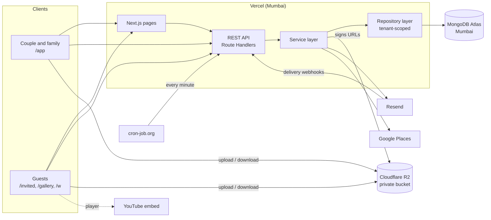
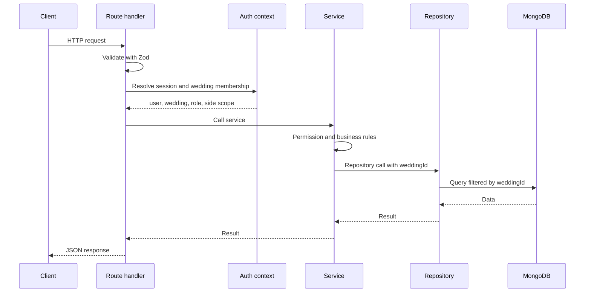
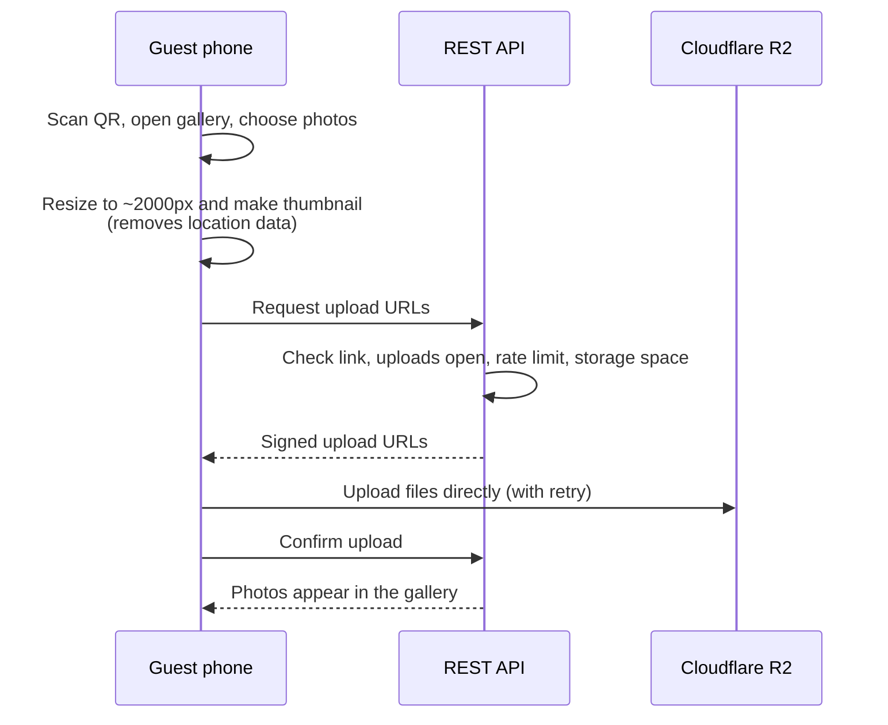
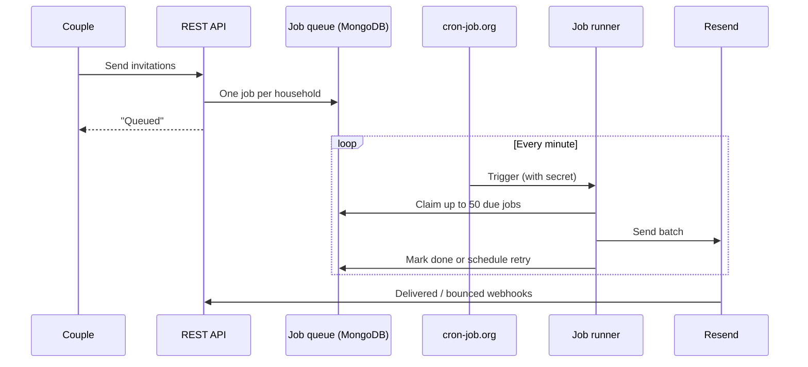

# Make My Marriage: System Architecture

| | |
|---|---|
| **Version** | 1.2 (architecture only) |
| **Date** | 28 September 2026 |
| **Owner** | Irfan |
| **Related docs** | PRD v1.1, Database Design v1.1, API Spec v1.1 |
| **Stage** | Development and learning, on free tiers |

This document describes how Make My Marriage v1 is structured and how its parts work together. Detailed API endpoints and the database schema are intentionally left out. The schema lives in the **Database Design** doc, and the endpoint list will live in a separate **API Specification**.

---

## 1. Goals and scale

### 1.1 Design goals
1. **Simple to build and run alone.** One codebase, one deployment, no servers to manage.
2. **Free while learning.** Every service starts on a free tier, with a clear upgrade path.
3. **Safe multi-tenancy.** No wedding can ever see another wedding's data.
4. **Guest-friendly.** Guest pages work on slow phones inside WhatsApp, without an account.
5. **Ready to grow.** Growth is handled by upgrading plans, not rewriting code.

### 1.2 Scale assumptions
| Dimension | Target |
|---|---|
| Guests per wedding | Up to 1,000 (about 200 to 400 households) |
| Photos per wedding | Up to 5,000 |
| Storage per wedding | Up to 3 GB |
| Weddings | Thousands eventually |
| Peak load | A wedding day: a few hundred guests uploading photos over a few hours |

---

## 2. Architecture decisions

| Area | Decision |
|---|---|
| Architecture | Modular monolith in one Next.js codebase |
| Language | TypeScript (strict mode) |
| Frontend | Next.js App Router, React, Tailwind CSS, shadcn/ui |
| Backend | Next.js Route Handlers exposing a REST API |
| Layering | Route handler → service → repository |
| Data access rule | The browser reads and writes only through the REST API. Server-rendered pages call the same module services directly through each module's public `index.ts` |
| Validation | Zod, shared between forms and API |
| Database | MongoDB Atlas with the official driver |
| Auth | Custom email and password, sessions stored in MongoDB, secure HttpOnly cookie |
| Roles | Admin and Manager per wedding, optional bride side / groom side scoping |
| Multi-tenancy | Shared database, `weddingId` on every tenant record, enforced in the repository layer |
| File storage | Cloudflare R2, private bucket, direct browser uploads and downloads with presigned URLs |
| Image processing | In the browser before upload |
| Email | Resend. Normal emails sent inline, bulk emails queued and sent in batches of 50 |
| Background jobs | Job queue stored in MongoDB, processed in short scheduled runs |
| Scheduling | cron-job.org every minute during development, Vercel Cron on Pro later |
| Vendor discovery | Google Places API (end of Phase 4) |
| Live stream | YouTube embed only |
| Hosting | Vercel Hobby during development, Pro for launch |
| Region | App and database in Mumbai |
| Observability | Structured logs, Vercel function logs, Atlas metrics |
| Not in v1 | Real-time updates, product analytics, email verification, CAPTCHA, wedding self-deletion, platform super-admin |

---

## 3. System overview



### 3.1 Key principles
- **One app, one deployment.** Pages and API ship together as one Vercel project.
- **Files bypass the app server.** The API only signs short-lived URLs. Browsers upload to and download from R2 directly.
- **No long-running processes.** Background work runs in short scheduled invocations that handle a small batch and exit.
- **Public pages render on the server** so WhatsApp link previews show the couple's names and photo. Server components call module services directly (never their own `/api` over HTTP). The private app loads data in the browser through the REST API.

### 3.2 Components
| Component | Responsibility |
|---|---|
| Next.js pages | Private app, public website, guest invitation and gallery pages |
| REST API | All reads and writes, authentication, authorization, validation |
| Service layer | Business rules and workflows per module |
| Repository layer | All database access, always scoped to one wedding |
| MongoDB Atlas | Application data, sessions, job queue, logs |
| Cloudflare R2 | Photos, invitation media, receipts, vendor documents, website images |
| Resend | Sending email and reporting delivery and bounces |
| cron-job.org | Triggering the job runner every minute and daily tasks once a day |
| Google Places | Wedding location search and nearby vendor search |
| YouTube | Hosting and streaming live video |

---

## 4. Application structure

### 4.1 Modules
| Module | Responsibility |
|---|---|
| `auth` | Sign-up, login, sessions, forgot password |
| `weddings` | Wedding profile, settings, archive |
| `members` | Team members, roles, side scope, member invites |
| `events` | Wedding events and timeline |
| `households` | Guest families, import, export, search |
| `invitations` | Sending invitations, guest link access, RSVP |
| `tasks` | Task planner |
| `expenses` | Expense tracker and summaries |
| `vendors` | Vendor tracker |
| `places` | Google Places integration |
| `website` | Wedding website and live stream |
| `gallery` | Photo uploads, viewing, moderation, downloads |
| `notifications` | Email templates and sending |
| `jobs` | Job queue and processors |
| `dashboard` | Dashboard summary, composed from other modules' services |
| `files` | R2 presigned URLs and upload verification |
| `audit` | Audit log entries |
| `system` | Health check |

### 4.2 Folder layout
```
src/
  app/            # Next.js pages; app/api/**/route.ts files only re-export handlers from modules
  modules/        # One folder per module: <m>.routes.ts, .service.ts, .repository.ts, .schemas.ts,
                  # .types.ts, .indexes.ts, and a public index.ts
  lib/            # Shared: env, config, logger, db client and tenant helpers, http envelope/errors, validation
  components/     # Shared UI (shadcn/ui primitives in components/ui)
scripts/          # Index creation, migrations, seed data
tests/            # Integration tests and test setup
```

### 4.3 Module rules
1. **Route handlers are thin.** Validate input, resolve the auth context, call one service function, return the response.
2. **Services hold business logic** and permission checks.
3. **Repositories are the only code that touches the database**, and every tenant function requires a `weddingId`.
4. **Modules talk through services, never another module's repository.**
5. **Each module exposes a public `index.ts`** (server-only). The only other file importable from outside is `<module>.schemas.ts`, which holds client-safe Zod schemas shared with forms and must never import server code.

### 4.4 Request lifecycle


---

## 5. Route architecture

| Area | Pages | API | Access |
|---|---|---|---|
| Account | `/login`, `/signup`, `/forgot-password`, `/reset-password` | `/api/auth/*`, `/api/me` | Public |
| Join a wedding | `/join/{token}` | `/api/member-invites/*` | Member invite token, then login |
| Private app | `/app` (wedding picker), `/app/{weddingId}/*` | `/api/weddings/{weddingId}/*` | Logged-in members of that wedding |
| Wedding website | `/w/{slug}` | `/api/public/sites/*` | Anyone, if published |
| Guest invitation | `/invited/{token}` | `/api/public/invitations/*` | Personal household token |
| Photo gallery | `/gallery/{token}` | `/api/public/gallery/*` | Gallery token |
| System | none | `/api/cron/*`, `/api/webhooks/*`, `/api/health` | Secret or signature |

**API style:** REST with JSON, one consistent success and error format, ISO dates in UTC, money in paise, and cursor pagination for lists. Full endpoint details belong in the API Specification.

---

## 6. Authentication

### 6.1 Login and sessions
- Email and password login. Passwords hashed with Argon2id.
- A random session ID is stored in an `HttpOnly`, `Secure`, `SameSite=Lax` cookie. The database stores only a hash of it.
- Sessions last 30 days and extend while the user is active. "Log out of all devices" ends every session.
- Login errors are generic, so the app never reveals which emails have accounts.
- No email verification in v1.

### 6.2 Forgot password
1. User enters their email. The app always shows the same success message.
2. If the account exists, a single-use reset link valid for 30 minutes is emailed.
3. After a successful reset, all existing sessions are ended.

### 6.3 CSRF protection
`SameSite=Lax` cookies, plus an `Origin` check on every request that changes data.

### 6.4 Joining a wedding
An Admin invites a family member by email with a role. The invitee opens the link, signs up or logs in with the same email, and becomes a member. One person can belong to several weddings and switch between them.

---

## 7. Authorization and multi-tenancy

### 7.1 Wedding context
Every private request resolves who the user is, which wedding they're working in, their role, and their side scope. A user who isn't a member of that wedding gets "not found", so other weddings can't even be detected.

### 7.2 Roles
| Capability | Admin | Manager |
|---|---|---|
| Events, guests, invitations, RSVPs, tasks, expenses, vendors, website content, gallery photos | ✅ | ✅ |
| Wedding profile, sides setting, location | ✅ | ❌ |
| Team members and roles | ✅ | ❌ |
| Publish website, change its address | ✅ | ❌ |
| Gallery settings and link regeneration | ✅ | ❌ |
| Archive or unarchive the wedding | ✅ | ❌ |

A wedding has at most 2 Admins and always at least 1.

### 7.3 Side scoping
When bride side / groom side is on, a Manager scoped to one side sees only that side's guests, everywhere: lists, search, exports, sending, RSVP counts and the dashboard. The filter is applied inside the repository layer, so no feature can miss it.

### 7.4 Tenant isolation
- One shared database. Every tenant record carries `weddingId`.
- Every query, update and delete is filtered by `weddingId` inside the repository layer.
- An automated test suite checks that no endpoint in one wedding can reach another wedding's data.

### 7.5 Guest access
Guests use unguessable 128-bit tokens in their links. A household token shows only that household's invitation, events and RSVP. The gallery token opens only that wedding's gallery. Both can be regenerated, which disables the old link immediately.

### 7.6 Archived weddings
Archived weddings are read-only. RSVPs and uploads close, while the website and gallery stay viewable. Admins can unarchive.

---

## 8. File storage

### 8.1 Approach
- One **private** Cloudflare R2 bucket. Nothing is publicly readable.
- The API signs short-lived URLs: 10 minutes for uploads, 1 hour for downloads.
- The allowed file type and size are locked into each upload signature.
- Files are organized per wedding, so a wedding's files can be found and removed together.

### 8.2 What's stored
| File | Limit |
|---|---|
| Gallery photos (display copy and thumbnail) | About 500 KB and 50 KB each |
| Invitation image or video | Image 10 MB, video 50 MB |
| Receipts and vendor documents | 10 MB (image or PDF) |
| Website photos | Resized in the browser |
| Total per wedding | 3 GB |

### 8.3 Guest photo upload


- No approval step. Photos appear immediately, and the couple can hide or delete any photo.
- Originals aren't kept. The display copy is the downloadable version.
- Photos are processed a few at a time so low-end phones don't run out of memory.
- Abandoned uploads are cleaned up daily.

### 8.4 Viewing and downloading
- The gallery loads 60 thumbnails at a time as the guest scrolls.
- "Download all" is built in the browser, in ZIP parts of about 500 photos, because a 3 GB ZIP can't be built inside a serverless function's time limit.

---

## 9. Email and background jobs

### 9.1 Two paths for email
| Type | Examples | Path |
|---|---|---|
| Normal | Password reset, member invite, RSVP confirmation, test invitation | Sent directly during the request |
| Bulk | Wedding invitations, RSVP reminders, task reminders | Queued, then sent in batches of 50 |

### 9.2 Bulk email flow


### 9.3 Queue rules
| Rule | Value |
|---|---|
| Batch size | 50 per run |
| Frequency | Every minute (up to about 3,000 emails per hour) |
| Safe claiming | Atomic claim with a lock, so overlapping runs never send the same email |
| Duplicate protection | An idempotency key per email |
| Retries | Up to 3, with backoff of 1, 5 and 30 minutes |
| Daily cap | Configurable (100 on Resend's free tier). Extra jobs wait for the next day |
| Time budget | Each run stops claiming work after about 8 seconds |

### 9.4 Scheduled work
| Schedule | Work |
|---|---|
| Every minute | Process queued jobs |
| Daily, 9:00 AM IST | Queue RSVP and task reminders, clean up abandoned uploads, expire old member invites, retention warnings and deletions |

Both are protected by a secret. Moving to Vercel Cron on the Pro plan needs only a schedule configuration change.

---

## 10. Google Places integration

- All calls go through the server. The API key is restricted and never reaches the browser.
- **Wedding location:** the Admin searches for the venue with Places Autocomplete, and the chosen place's coordinates are saved with a default 10 km search radius.
- **Vendor discovery:** Text Search around the wedding location by category (photographer, caterer, mehendi artist, and so on), requesting only basic fields to stay in the cheaper pricing tier. Contact details are fetched only when a result is opened.
- **Saving a vendor** adds it to the vendor tracker, keeping Google's place ID plus details the couple confirms.
- **Cost control:** 50 vendor searches per wedding per month, and a billing alert in Google Cloud.
- **Terms:** only the place ID is stored long-term, and Google results show Google attribution.

---

## 11. Public pages

| Page | Behaviour |
|---|---|
| Wedding website `/w/{slug}` | Server-rendered with link preview tags, cached and refreshed when the couple saves changes, hidden from search engines unless the couple opts in |
| Website address | `{bride}-{groom}-{dd}-{mon}-{yyyy}`, e.g. `nafiya-irfan-14-apr-2028`. A suffix is added if taken, and the Admin can edit it before publishing |
| Live stream | YouTube links only, embedded with YouTube's privacy-enhanced player, with a countdown to the start time |
| Invitation `/invited/{token}` | Server-rendered greeting, invitation media, and only the household's own events. After the page loads, the browser calls `POST /api/public/invitations/{token}/opened` to mark it opened, so link-preview bots (WhatsApp, Gmail) never count as opens |
| Gallery `/gallery/{token}` | Upload and browse, hidden from search engines |

---

## 12. Security

| Area | Measure |
|---|---|
| Transport | HTTPS only, HSTS |
| Headers | Content Security Policy, no sniffing, strict referrer policy, no framing except YouTube |
| Input | Every request validated with Zod, unknown fields rejected, database operators stripped |
| Data access | Tenant filter on every query, side scoping in the repository layer |
| Auth | Argon2id passwords, hashed session and reset tokens, generic errors, rate limits |
| Guest links | Unguessable, regenerable, hidden from search engines |
| Files | Private bucket, short-lived signed URLs, type and size locked, location data stripped |
| Secrets | Vercel environment variables, validated at startup, never sent to the browser |
| Cron and webhooks | Secret header for cron, signature check for Resend |
| Audit | Sensitive actions recorded in an audit log |

### 12.1 Rate limits
| Action | Limit |
|---|---|
| Login | 5 per 15 minutes per email, 20 per IP |
| Sign-up | 5 per hour per IP |
| Forgot password | 3 per hour per email |
| Viewing an invitation | 60 per minute per link |
| Submitting an RSVP | 10 per minute per link |
| Gallery upload requests | 30 per 10 minutes per link and device, up to 50 photos each |
| Gallery browsing | 120 per minute per link and device |
| Vendor search | 50 per wedding per month |

Counters are stored in MongoDB and expire automatically.

---

## 13. Observability

| What | Where |
|---|---|
| Request errors and slow requests | Structured JSON logs (with request ID, route, wedding, duration) in Vercel function logs |
| Email sent, delivered, bounced or failed | Email log records in MongoDB |
| Queue health | Job records in MongoDB (queued, failed, oldest waiting) |
| Database performance | Atlas metrics and Performance Advisor |
| Is the app up | `/api/health` checks the database connection |

Passwords, tokens and session IDs are never logged. Vercel Hobby keeps logs only briefly, so anything that must be traceable later is also stored in MongoDB.

---

## 14. Performance and scalability

### 14.1 Practices
- One database client reused per function instance, with a small connection pool so serverless instances don't exhaust Atlas connections.
- App functions and database in the same region.
- Lists are paginated and return only the fields each screen needs.
- The dashboard loads in one request.
- Public pages are cached.
- Photos go straight between browsers and R2, never through the app.

### 14.2 Capacity
| | Per wedding | 1,000 weddings |
|---|---|---|
| Database | ~5 MB | ~5 GB |
| File storage | Up to 3 GB | Up to ~3 TB (roughly $45/month on R2, with no download fees) |

### 14.3 Free-tier limits
| Service | Limit | Upgrade when |
|---|---|---|
| MongoDB Atlas M0 | 512 MB, no automated backups | Before the first real wedding |
| Vercel Hobby | Non-commercial only, short log retention, daily-only cron | Before launch |
| Resend free | 100 emails per day, needs a verified domain for real recipients | Before the first real invitation round |
| No domain yet | Emails reach only your own address, no custom URLs | Before the first real wedding |

---

## 15. Environments and deployment

| Environment | Hosting | Database | Storage | Email |
|---|---|---|---|---|
| Local | `next dev` | Atlas dev cluster | Dev bucket | Test mode |
| Preview | Vercel preview per branch | Atlas dev cluster | Dev bucket | Test mode |
| Production | Vercel production | Atlas production cluster | Production bucket | Verified domain |

**Pipeline**
1. Push to GitHub. Vercel builds a preview for every branch.
2. Type check, lint, unit and integration tests run, including the tenant isolation tests.
3. Merging to `main` deploys to production.
4. The index script runs after every deploy.

**Configuration:** all secrets and settings (database, R2, Resend, cron secret, Google key, daily email limit) come from environment variables, validated with Zod at startup in `src/lib/env.ts`. Each variable is added to the schema, as required, in the phase that first needs it. The app won't start if a required one is missing.

---

## 16. Testing strategy

| Level | Tool | Focus |
|---|---|---|
| Unit | Vitest | Business rules, permissions, slug creation, money formatting, validation |
| Integration | Vitest with a dedicated Atlas test database (`TEST_MONGODB_URI`, a throwaway `test_*` database per run) | API behaviour end to end, tenant isolation, side scoping, RSVP rules, job retries |
| End to end | Playwright | Sign up, create a wedding, add guests, send invitations, guest RSVP on a phone-sized screen, gallery upload |

**Must pass before the first real wedding**
- A member of one wedding can never reach another wedding's data.
- A side-scoped Manager never sees the other side's guests anywhere.
- Attending counts never exceed the invited headcount.
- No email is ever sent twice.
- Archived weddings reject all changes.

---

## 17. Upgrade path

| Step | When | Change |
|---|---|---|
| 1. Domain | Before any real guest gets an email | Verify it in Resend, connect it to Vercel |
| 2. Paid database with backups | Before the first real wedding | Upgrade Atlas from M0 |
| 3. Resend Pro | Before the first real invitation round | Raise the daily email limit |
| 4. Vercel Pro | Commercial launch | Move schedules to Vercel Cron, longer logs |
| 5. Email verification | Before public launch | Verify email on sign-up |
| 6. Error tracking | When traffic grows | Add Sentry or similar |
| 7. Separate worker | If one-minute batches aren't enough | Run the same job code as its own service |
